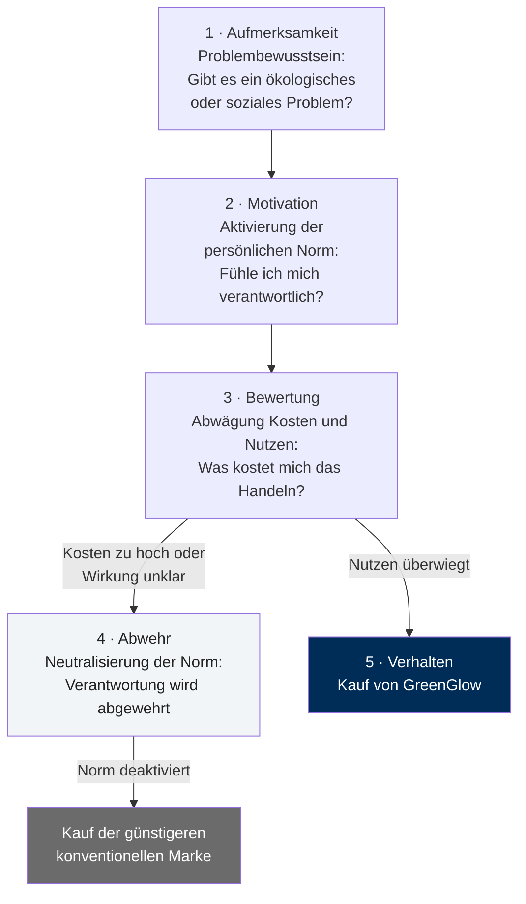
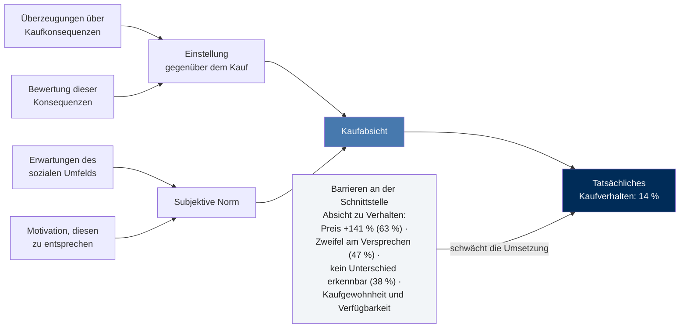

# GreenGlow — Nachhaltige Körperpflege zwischen Anspruch und Akzeptanz

Gruppenfallstudie zu Abschnitt 2.4 · Sustainable Marketing und Marketingethik
Quelle: `02_materialien/Gruppenfallstudien_Marketing.pdf` (Fallstudie 2, ca. 60 Min.)

---

## Ausgangssituation

Die GreenGlow GmbH produziert Duschgels, Shampoos und Handseifen konsequent nach
ökologischen und sozialen Prinzipien (Bio-Inhaltsstoffe, erneuerbare Energien,
100 % Rezyklat-Verpackung mit Nachfüllsystem, faire Lieferkette, keine
Tierversuche, klimaneutrale Logistik). Das Unternehmen folgt dem Leitbild des
Sustainable Marketings (Kenning 2014, S. 563). Trotz positiver Bewertungen durch
Umweltorganisationen bleibt der Absatz deutlich hinter den Erwartungen zurück.

**Kundenbefragung — die zentrale Diskrepanz:**

| Aussage der Kunden | Anteil |
|---|---|
| „Nachhaltigkeit ist mir beim Kauf von Pflegeprodukten wichtig." | 72 % |
| „Ich bin grundsätzlich bereit, nachhaltiger zu konsumieren." | 68 % |
| **„Ich kaufe GreenGlow regelmäßig."** | **14 %** |
| „Die Produkte sind mir zu teuer." | 63 % |
| „Ich bin unsicher, ob die Nachhaltigkeitsversprechen wirklich stimmen." | 47 % |
| „Ich sehe keinen großen Unterschied zu günstigeren Marken." | 38 % |

**Preisvergleich:** Standard-Duschgel 2,49 € · GreenGlow-Duschgel 5,99 €
→ Aufpreis **+3,50 € bzw. +141 %**.

**Leitfrage der Geschäftsführung:** Wie kann GreenGlow nachhaltiges Verhalten
fördern, ohne die eigene Glaubwürdigkeit zu verlieren?

---

## Teil 1 · Analyse des Konsumentenverhaltens

### 1.1 Postmaterialistisches Konsumverhalten

Postmaterialismus beschreibt das Streben nach dem „Übergeordneten" — Gesundheit,
Umweltschutz, Kultur, Bildung — statt nach dem greifbaren Materiellen; materielle
Werte des „Habens" treten in wohlhabenden Industriegesellschaften zugunsten
postmaterieller Werte des „Seins" zurück.

Im Fall zeigt sich das an drei Stellen:

- **Werteorientierung ist vorhanden:** 72 % erklären Nachhaltigkeit zum
  Kaufkriterium, 68 % bekunden Konsumbereitschaft. Nachhaltigkeit ist damit kein
  Nischenwert, sondern gesellschaftlicher Mainstream.
- **Sie ist aber nicht kaufwirksam:** nur 14 % kaufen regelmäßig. Der
  postmaterielle Wert bleibt auf der Einstellungsebene stehen.
- **Materielle Restriktion dominiert die Entscheidung:** 63 % nennen den Preis.
  Postmaterielle Werte werden im Alltagskauf einer Low-Involvement-Kategorie
  offenbar nur solange verfolgt, wie sie wenig kosten.

**Kernbefund:** Der Wertewandel ist bei GreenGlows Zielgruppe vollzogen — er
schlägt aber nicht in Zahlungsbereitschaft durch.

### 1.2 Warum entsteht die Lücke zwischen Einstellung und Kaufverhalten?

Die **Attitude-Behaviour-Gap** beträgt hier 72 % vs. 14 % — rund 58
Prozentpunkte. Der Fall liefert drei messbare Ursachen und drei strukturelle:

| Ursache | Beleg im Fall | Wirkmechanismus |
|---|---|---|
| **Preisbarriere** | 63 % „zu teuer" | +141 % Aufpreis bei einem Alltagsprodukt mit geringem Involvement |
| **Glaubwürdigkeitslücke** | 47 % unsicher, ob Versprechen stimmen | Greenwashing-Erfahrungen entwerten das Leistungsversprechen; Nachhaltigkeit ist ein Vertrauensmerkmal, das der Kunde nicht selbst prüfen kann |
| **Fehlende Differenzierung** | 38 % sehen keinen Unterschied | Ohne wahrgenommenen Unterschied gibt es keine Begründung für den Aufpreis |

Ergänzend, nicht direkt aus den Zahlen ablesbar:

- **Low Involvement:** Duschgel wird routiniert und schnell gekauft. Komplexe
  Nachhaltigkeitsargumente erreichen den Käufer am Regal nicht.
- **Soziales Dilemma:** Die Kosten trägt der Einzelne, den Nutzen die
  Allgemeinheit. Das begünstigt Trittbrettfahren („die anderen kaufen ja
  nachhaltig").
- **Soziale Erwünschtheit:** Die 72 % sind eine Befragungsantwort, kein Kassenbon.
  Ein Teil der bekundeten Einstellung ist überzeichnet.

**Entscheidender Punkt für die Diskussion:** Preis und Glaubwürdigkeit wirken
*multiplikativ*. Wer den Mehrwert nicht glaubt (47 %) und keinen Unterschied
erkennt (38 %), für den ist jeder Aufpreis zu hoch — auch ein kleinerer. Die
63 % „zu teuer" sind deshalb überwiegend ein **Wert-Problem, kein Preisproblem**.

### 1.3 Rolle der Consumer Social Responsibility (ConSR)

ConSR ist die bewusste und vorsätzliche Entscheidung, eine Konsumentscheidung
aufgrund persönlicher und moralischer Überzeugungen zu treffen (Devinney et al.
2006, S. 32). Sie äußert sich in vier Verhaltensweisen — auf GreenGlow bezogen:

| ConSR-Ausprägung | Bezug zum Fall |
|---|---|
| Bewusster Verzicht auf nicht-nachhaltige Produkte | greift kaum — 86 % kaufen weiter konventionell |
| Wahl des relativ nachhaltigsten Produkts einer Gruppe | **der entscheidende Hebel** — GreenGlow muss als das relativ nachhaltigste *sichtbar erkennbar* sein (38 % erkennen den Unterschied nicht) |
| Nachhaltige Nutzung | ungenutztes Potenzial — Nachfüllsystem ist vorhanden, wird aber nicht als Nutzenargument gespielt |
| Nachhaltige Entsorgung/Verwertung | Rezyklat-Verpackung schließt den Kreislauf, bleibt aber unkommuniziert |

**Befund:** ConSR ist bei GreenGlow nur in einer kleinen Kerngruppe (≈ 14 %)
verhaltenswirksam. Bei der breiten Masse bleibt sie **Einstellung ohne
Handlungskonsequenz**, weil zwei Voraussetzungen fehlen: verlässliche
Information (Glaubwürdigkeit) und ein erkennbarer relativer Vorteil
(Differenzierung). ConSR erklärt damit gut, *wer* kauft — aber nicht, warum
die Mehrheit nicht kauft. Dafür braucht es die Modelle aus Teil 2 und 3.

---

## Teil 2 · Norm-Aktivierungs-Modell

Das Norm-Aktivierungs-Modell erklärt, unter welchen Bedingungen aus einer
allgemeinen moralischen Überzeugung tatsächliches Verhalten wird (Meffert et al.
2019, S. 137 ff.). Die persönliche Norm wird nur dann handlungsleitend, wenn der
Konsument das Problem wahrnimmt, sich selbst verantwortlich fühlt und seinen
Beitrag für wirksam hält.

Bei GreenGlow bricht der Prozess nicht in Phase 1 ab, sondern in den Phasen 3
und 4 — die Zuordnung der Fallbelege zeigt die folgende Tabelle.

### 2.1 Phasenanalyse für GreenGlow

| Phase | Status bei GreenGlow | Handlungsbedarf |
|---|---|---|
| **Aufmerksamkeit** | Problembewusstsein grundsätzlich hoch (72 %), aber abstrakt — kein Bezug zum konkreten Duschgel im Regal | Problem am Produkt sichtbar machen |
| **Motivation** | Norm wird nicht aktiviert; Verantwortung wird an Hersteller und Politik delegiert | persönliche Zuständigkeit adressieren |
| **Bewertung** | Kosten sind konkret (+3,50 €), Nutzen bleibt vage → Abwägung fällt gegen GreenGlow aus | Nutzen quantifizieren, Kosten pro Anwendung senken |
| **Abwehr** | starke Neutralisierung: „bringt eh nichts" (Wirksamkeitszweifel), „ist doch dasselbe" (38 %), „stimmt vermutlich nicht" (47 %) | Wirksamkeit belegen, Zweifel entkräften |
| **Verhalten** | nur 14 % regelmäßig | — |

**Kernaussage:** GreenGlow scheitert nicht in Phase 1, sondern in den Phasen 3
und 4. Mehr Aufklärung über Umweltprobleme allein löst das Problem also nicht.

### 2.2 Drei konkrete Maßnahmen

**Maßnahme 1 — Wirkungsanzeige direkt am Produkt** *(adressiert Phase 1 + 4)*

Auf Flasche und Regaletikett steht der konkrete Effekt **dieser einen Flasche**:
„Diese Flasche spart gegenüber einem Standard-Duschgel 82 g Neuplastik und
1,4 kg CO₂." Ergänzt um einen QR-Code mit der Herleitung der Zahl.

*Warum das wirkt:* Es überführt das abstrakte Problem in eine konkrete,
zurechenbare Größe (Phase 1) und entzieht der Neutralisierung „bringt eh nichts"
die Grundlage (Phase 4). Die Zahl macht den Nutzen erstmals verrechenbar gegen
die 3,50 € Aufpreis.

**Maßnahme 2 — Unabhängige Zertifizierung und rückverfolgbare Lieferkette**
*(adressiert Phase 2 + 4)*

Etablierte Drittsiegel (z. B. NATRUE, EU Ecolabel, Fairtrade) statt
Eigenaussagen, plus ein per Chargennummer abrufbarer Lieferketten-Nachweis mit
den echten Zulieferbetrieben. Zusätzlich ein öffentlicher Nachhaltigkeitsbericht,
der auch benennt, was **noch nicht** klimaneutral ist.

*Warum das wirkt:* Die 47 % Skepsis sind der größte Hebel, den GreenGlow
vollständig selbst kontrolliert. Die freiwillige Offenlegung von Schwachstellen
ist dabei glaubwürdigkeitsstiftend und entspricht dem Ethikkodex-Grundsatz
„foster trust in the marketing system" (AMA, zit. n. Kotler/Armstrong 2020,
S. 583). Ohne belegtes Versprechen bleibt jede Wirkungsanzeige aus Maßnahme 1
wertlos.

**Maßnahme 3 — Nachfüll-Abo mit sichtbarem Kollektivzähler**
*(adressiert Phase 3 + 4)*

Einmalkauf der Glas-/Rezyklatflasche, danach Nachfüllbeutel im Abo zu einem
deutlich niedrigeren Preis pro Anwendung. Im Kundenkonto und auf der Website
läuft ein Zähler: „Gemeinsam haben wir bisher 412 t Plastik vermieden — dein
Anteil: 1,9 kg."

*Warum das wirkt:* Der Abopreis senkt die wahrgenommenen Kosten in Phase 3,
ohne den Markenwert durch eine generelle Preissenkung zu beschädigen — die
Positionierung bleibt Premium, nur die Nutzungsform wird günstiger. Der
Kollektivzähler macht sichtbar, dass andere ebenfalls handeln, und entkräftet so
gleichzeitig die Wirksamkeits-Neutralisierung und das Trittbrettfahrer-Argument
(Phase 4).

### 2.3 Zuordnung zu den drei Leitfragen der Aufgabe

| Leitfrage aus dem PDF | Antwort in Kurzform | Maßnahme |
|---|---|---|
| Wie kann GreenGlow das **Bewusstsein** für ökologische und soziale Probleme erhöhen? | Nicht durch mehr allgemeine Aufklärung — das Bewusstsein ist mit 72 % bereits hoch. Sondern durch Verlagerung des abstrakten Problems an den konkreten Kaufakt: der Effekt **dieser** Flasche, sichtbar am Regal. | 1 |
| Wie kann verdeutlicht werden, dass die **Kaufentscheidung einen Unterschied macht**? | Wirkung beziffern *und* belegen: Zahl pro Flasche, Herleitung per QR-Code, individueller und kollektiver Zähler im Kundenkonto. Ohne Beleg wirkt jede Zahl wie Werbung. | 1 + 3 |
| Welche Maßnahmen aktivieren **persönliche Verantwortung** und nachhaltiges Verhalten? | Verantwortung lässt sich nur annehmen, wenn Zweifel ausgeräumt sind (Drittsiegel, offengelegte Lieferkette) und der eigene Beitrag als wirksam und bezahlbar erlebt wird (Abo, Kollektivzähler). | 2 + 3 |

### 2.4 Ethische Leitplanke

Alle drei Maßnahmen müssen belegbar bleiben. Übertriebene oder ungeprüfte
Wirkungsangaben wären irreführende Werbung und damit unmoralisches
Marketingverhalten (Kay-Enders 1996, S. 15 ff.). Angstappelle („Ohne dich stirbt
der Ozean") sind aus demselben Grund auszuschließen — sie erzeugen kurzfristige
Aktivierung, beschädigen aber langfristig genau die Glaubwürdigkeit, die
GreenGlow fehlt.

---

## Teil 3 · Theory of Reasoned Action

Nach dem Einstellungsmodell von Ajzen und Fishbein (1973, S. 41 ff.; vgl.
Homburg 2020, S. 44) entsteht Verhalten aus der Verhaltensabsicht, die wiederum
von zwei Determinanten gespeist wird: der **Einstellung gegenüber dem Verhalten**
und der **subjektiven Norm**.

### 3.1 Die vier Konstrukte im Fall

| Konstrukt | Ausprägung bei GreenGlow |
|---|---|
| **Einstellung gegenüber GreenGlow** | grundsätzlich positiv (72 % / 68 %, gute Bewertungen von Umweltorganisationen), aber **instabil** — 47 % zweifeln an den Versprechen, 38 % erkennen keinen Vorteil. Die positive Einstellung gilt der *Idee* Nachhaltigkeit, nicht belegbar der *Marke* GreenGlow. |
| **Subjektive soziale Normen** | **schwach.** Körperpflege wird privat konsumiert — niemand sieht die Flasche im Bad. Es fehlt sozialer Druck ebenso wie soziale Anerkennung. Umgekehrt existiert eine gegenläufige Norm: „vernünftig einkaufen, nicht das Dreifache zahlen". |
| **Kaufabsicht** | mittel bis gering. Sie entsteht aus einer positiven, aber unbelegten Einstellung und einer schwachen Norm — beide Determinanten liefern zu wenig Kraft. |
| **Tatsächliches Verhalten** | 14 %. Selbst die vorhandene Absicht wird am Regal durch Preis und Gewohnheit abgebrochen. |

### 3.2 Antworten auf die drei Fragen

**(1) Welche Barrieren verhindern den Kauf?**

- **Preis-Wert-Barriere:** +3,50 € Aufpreis (+141 %) ohne erkennbare Gegenleistung.
- **Glaubwürdigkeitsbarriere:** 47 % zweifeln — Nachhaltigkeit ist ein
  Vertrauensmerkmal, das der Käufer nicht selbst überprüfen kann.
- **Differenzierungsbarriere:** 38 % sehen keinen Unterschied — ohne
  wahrgenommenen Unterschied gibt es kein Kaufargument.
- **Normbarriere:** Der Konsum ist unsichtbar, es fehlt jede soziale Verstärkung.
- **Verhaltensbarriere:** Routinekauf in einer Low-Involvement-Kategorie; die
  Marke ist im Zweifel im gewohnten Regal gar nicht präsent.

**(2) Welche Faktoren könnten die Kaufabsicht positiv beeinflussen?**

*Über die Einstellung:*
- Verifizierbare Nachweise (Drittsiegel, Lieferketten-Transparenz) statt Eigenaussagen.
- Quantifizierter Nutzen pro Flasche statt allgemeiner Nachhaltigkeitsrhetorik.
- **Produktleistung mitverkaufen:** Hautverträglichkeit, Duft, Ergiebigkeit. Wer
  ein besseres Produkt bekommt, braucht den moralischen Aufpreis nicht allein zu
  rechtfertigen.
- Preis pro Anwendung statt Preis pro Flasche kommunizieren (Nachfüllsystem).

*Über die subjektive Norm:*
- Konsum sichtbar machen: markantes Design, Empfehlungsprogramme, sichtbarer
  Kollektivzähler, Community-Formate.
- Referenzpersonen aus dem realistischen Umfeld statt Hochglanz-Influencer —
  das schützt zugleich die Glaubwürdigkeit.

**(3) Welche Kommunikationsbotschaften wären geeignet?**

| Botschaftstyp | Beispielaussage | Adressiert |
|---|---|---|
| **Beleg statt Behauptung** | „Jede Zutat rückverfolgbar — Chargennummer eingeben und selbst nachsehen." | 47 % Skepsis |
| **Konkreter Wirkungsbeleg** | „Eine Flasche = 82 g weniger Neuplastik." | Differenzierung, Wirksamkeitszweifel |
| **Preisrahmung** | „Im Nachfüll-Abo 0,19 € pro Anwendung." | Preisbarriere |
| **Soziale Norm** | „Schon 40.000 Haushalte duschen so." | schwache subjektive Norm |
| **Produktnutzen zuerst** | „Zuerst gut zu deiner Haut. Und dann zum Planeten." | Einstellung gegenüber dem Produkt selbst |

Nicht geeignet: Angst- und Schuldappelle (unethisch, siehe 2.3) sowie vage
Superlative („das nachhaltigste Duschgel") — sie verschärfen die 47-%-Skepsis.

### 3.3 Randnotiz zur Modellgrenze

Die TRA erklärt die Absichtsbildung gut, unterstellt aber, dass Absicht
weitgehend in Verhalten mündet. Genau das trifft hier nicht zu: Der Preis ist
eine reale Ressourcenschranke, die die Umsetzung blockiert. Die Erweiterung um
die **wahrgenommene Verhaltenskontrolle** (Theory of Planned Behavior) ist
deshalb der passendere Rahmen — sie erklärt, warum das Nachfüll-Abo
(Kostensenkung ohne Positionierungsverlust) stärker wirkt als jede weitere
Einstellungskampagne.

---

## Präsentation im Plenum

> ### 1. Die größte Kaufbarriere
> **Die Preis-Wert-Lücke — nicht der Preis allein.**
> 63 % sagen „zu teuer", aber 38 % sehen keinen Unterschied und 47 % glauben dem
> Versprechen nicht. Ein Aufpreis von 141 % ist nur dann zu hoch, wenn kein
> belegter Mehrwert gegenübersteht. GreenGlow hat kein Preisproblem, sondern ein
> **Nachweisproblem**.
>
> ### 2. Die wichtigste Marketingmaßnahme
> **Belegte Wirkung am Produkt: Drittzertifizierung plus konkrete Wirkungsanzeige
> pro Flasche.**
> Erst wenn der Nutzen überprüfbar und bezifferbar ist, wird der Aufpreis
> verhandelbar. Alle weiteren Maßnahmen — Abo, Community, Kampagne — bauen darauf
> auf und wirken ohne diese Basis nicht.
>
> ### 3. Neuer Kommunikationsslogan
> **Empfehlung: „Wirkt. Und wir zeigen dir, wie."**
> Doppeldeutig auf Produktleistung und Umweltwirkung, verspricht Beleg statt
> Behauptung, funktioniert als Klammer für Siegel, Wirkungsanzeige und QR-Code.
>
> *Alternativen:*
> - „Jede Zutat. Jeder Weg. Nachprüfbar." — maximaler Fokus auf Transparenz.
> - „82 Gramm weniger. Pro Flasche." — Wirkung als Zahl, maximal konkret.

---

## Offene Annahmen

Der Fall gibt Folgendes nicht her; die Argumentation trifft dazu Annahmen:

- **Kostenstruktur und Marge** — ob GreenGlow eine günstigere Nachfüllvariante
  überhaupt tragen kann, ist unbekannt. Maßnahme 3 setzt eine ausreichende
  Rohmarge voraus.
- **Zielgruppensegmentierung** — die 14 % Käufer sind nicht beschrieben. Ob es
  sich um eine kaufkräftige Kerngruppe oder um Zufallskäufer handelt, ändert die
  Strategie erheblich.
- **Vertriebskanal und Distribution** — ob GreenGlow im Drogerieregal, online
  oder in Bioläden verkauft, bestimmt, welche Maßnahmen am Point of Sale
  überhaupt greifen.
- **Wettbewerbsumfeld** — Anzahl und Positionierung nachhaltiger Konkurrenten
  sind unbekannt; die 2,49 € beziehen sich auf ein konventionelles Standardprodukt.
- **Herkunft der Wirkungszahlen** — die im Dokument genannten 82 g Plastik und
  1,4 kg CO₂ sind **illustrative Platzhalter**. In der Umsetzung müssten sie aus
  einer echten Ökobilanz stammen, sonst wären sie irreführende Werbung.
- **Belastbarkeit der Befragung** — Stichprobengröße und Erhebungsmethode sind
  nicht angegeben; soziale Erwünschtheit überzeichnet die Einstellungswerte
  vermutlich.

---

## Quellen

Ajzen, Icek, und Martin Fishbein. 1973. „Attitudinal and Normative Variables as
Predictors of Specific Behaviors." *Journal of Personality and Social Psychology*
27 (1): 41–57.

Devinney, Timothy M., Pat Auger, Giana Eckhardt, und Thomas Birtchnell. 2006.
„The Other CSR: Consumer Social Responsibility." *Stanford Social Innovation
Review* 4 (3): 30–37.

Homburg, Christian. 2020. *Grundlagen des Marketingmanagements. Einführung in
Strategie, Instrumente, Umsetzung und Unternehmensführung*. 6. Aufl. Wiesbaden:
Springer Gabler.

Kay-Enders, Barbara. 1996. *Marketing und Ethik*. Wiesbaden: Deutscher
Universitätsverlag.

Kenning, Peter. 2014. „Sustainable Marketing — Definition und begriffliche
Abgrenzung." In *Sustainable Marketing Management*, herausgegeben von Heribert
Meffert, Peter Kenning und Manfred Kirchgeorg, 563 ff. Wiesbaden: Springer Gabler.

Kotler, Philip, und Gary Armstrong. 2020. *Principles of Marketing*. 18. Aufl.
Harlow: Pearson.

Meffert, Heribert, Christoph Burmann, Manfred Kirchgeorg, und Maik Eisenbeiß.
2019. *Marketing. Grundlagen marktorientierter Unternehmensführung. Konzepte —
Instrumente — Praxisbeispiele*. 13. Aufl. Wiesbaden: Springer Gabler.

> **Hinweis zur Zitation:** Alle Modelle und Definitionen sind über die
> Vorlesungsunterlagen (S. 57–65) belegt. Gemäß der Arbeitsregel in
> `../../README.md` sind die Folien selbst **nicht** als alleinige
> wissenschaftliche Quelle zu führen — für den Praxisbericht sind die
> Primärquellen zu verwenden und die Seitenzahlen dort zu verifizieren.
